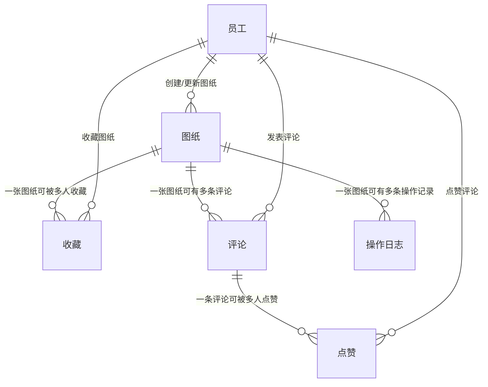

# 天枢系统 — 数据库表结构设计文档

> **版本**：v1.0  
> **日期**：2026-07-02  
> **数据库**：MySQL 5.7+（InnoDB 引擎）  
> **字符集**：utf8mb4

---

## 1. 数据库整体关系



### 1.1 表间关系说明

| 主表                  | 子表                       | 关联字段     | 关系     | 业务含义                     |
| --------------------- | -------------------------- | ------------ | -------- | ---------------------------- |
| `sys_drawing`         | `sys_drawing_collect`      | `drawing_id` | 一对多   | 一张图纸可以被多个用户收藏   |
| `sys_drawing`         | `sys_drawing_comment`      | `drawing_id` | 一对多   | 一张图纸可以有多条评论       |
| `sys_drawing_comment` | `sys_drawing_comment_like` | `comment_id` | 一对多   | 一条评论可以被多个用户点赞   |
| `sys_drawing`         | `sys_file_operation_log`   | `drawing_id` | 一对多   | 一张图纸可以有多条操作记录   |
| `temp_person`         | 所有业务表                 | `created_by` | 间接关联 | 通过创建人 ID 关联到员工信息 |

---

## 2. 核心业务表

### 2.1 `sys_drawing` — 图纸主表

#### 2.1.1 表说明

图纸是系统的核心业务实体，存储所有图纸的元数据信息。图纸的图片和源文件以文件 ID 的形式存储，实际文件存储在 S3 对象存储中。分类、标签、图片 ID 以 JSON 数组格式存储在单字段中。

#### 2.1.2 建表语句

```sql
CREATE TABLE `sys_drawing` (
  `id` bigint(20) NOT NULL AUTO_INCREMENT COMMENT '主键ID',

  -- 基本信息
  `drawing_title` varchar(500) DEFAULT NULL COMMENT '图纸标题',
  `drawing_content` text COMMENT '图纸介绍/功能描述',
  `drawing_url` varchar(500) DEFAULT NULL COMMENT '图纸源文件地址（对象存储中的文件ID）',
  `drawing_img` varchar(2000) DEFAULT NULL COMMENT '展示图片ID列表，JSON数组格式，如["1001","1002"]',
  `drawing_carousel` varchar(500) DEFAULT NULL COMMENT '轮播图标识',

  -- 分类信息
  `drawing_column` varchar(1000) DEFAULT NULL COMMENT '文件分类，JSON数组，如["机械","电气"]',
  `drawing_purpose` varchar(200) DEFAULT NULL COMMENT '图纸用途（存档/校核/测绘等）',
  `drawing_format` varchar(100) DEFAULT NULL COMMENT '文件格式（PDF/DWG/PNG/JPG/STP等）',
  `drawing_label` varchar(1000) DEFAULT NULL COMMENT '图纸标签，JSON数组，如["贴胶机","端板"]',
  `drawing_platform` varchar(200) DEFAULT NULL COMMENT '所属平台/机型（如H03底部水冷）',
  `drawing_line` varchar(200) DEFAULT NULL COMMENT '所属拉线/产线（如XM-PL01）',

  -- 技术参数
  `drawing_beat` varchar(200) DEFAULT NULL COMMENT '设备节拍参数',
  `drawing_appearance` varchar(200) DEFAULT NULL COMMENT '外观尺寸（长×宽×高）',
  `drawing_match` varchar(500) DEFAULT NULL COMMENT '产品兼容信息',
  `drawing_exchange` varchar(500) DEFAULT NULL COMMENT '换型时间',
  `drawing_technology` text COMMENT '工艺要求说明',

  -- 审计字段
  `creation_date` datetime NOT NULL DEFAULT CURRENT_TIMESTAMP COMMENT '创建时间',
  `created_by` bigint(20) DEFAULT NULL COMMENT '创建人工号',
  `created_by_name` varchar(100) DEFAULT NULL COMMENT '创建人姓名',
  `last_update_date` datetime NOT NULL DEFAULT CURRENT_TIMESTAMP ON UPDATE CURRENT_TIMESTAMP COMMENT '最后更新时间',
  `last_updated_by` bigint(20) DEFAULT NULL COMMENT '最后更新人工号',
  `last_updated_by_name` varchar(100) DEFAULT NULL COMMENT '最后更新人姓名',

  PRIMARY KEY (`id`),
  KEY `idx_drawing_title` (`drawing_title`),
  KEY `idx_drawing_platform` (`drawing_platform`),
  KEY `idx_drawing_line` (`drawing_line`),
  KEY `idx_drawing_format` (`drawing_format`)
) ENGINE=InnoDB DEFAULT CHARSET=utf8mb4 COMMENT='图纸主表——存储图纸的元数据信息';
```

#### 2.1.3 字段详细说明

| 字段名             | 类型          | 是否必填 | 说明                                                                    |
| ------------------ | ------------- | -------- | ----------------------------------------------------------------------- |
| id                 | bigint(20)    | 是       | 自增主键，其他业务表通过此 ID 关联图纸                                  |
| drawing_title      | varchar(500)  | 推荐填写 | 图纸名称，搜索时权重最高（权重 4）                                      |
| drawing_content    | text          | 否       | 图纸的功能描述和工作原理说明，搜索权重 2                                |
| drawing_url        | varchar(500)  | 推荐填写 | 图纸源文件在对象存储中的文件 ID，用于下载                               |
| drawing_img        | varchar(2000) | 否       | 展示图片的文件 ID 列表，JSON 数组格式。列表页只展示首张，详情页展示全部 |
| drawing_carousel   | varchar(500)  | 否       | 轮播图标识，预留字段                                                    |
| drawing_column     | varchar(1000) | 否       | 文件分类，可选值包含机械、电气、液压、气动、其他等。JSON 数组，支持多选 |
| drawing_purpose    | varchar(200)  | 否       | 图纸用途描述，如存档、校核、测绘                                        |
| drawing_format     | varchar(100)  | 否       | 图纸文件的格式类型                                                      |
| drawing_label      | varchar(1000) | 否       | 用户自定义标签，JSON 数组，用于辅助检索和归类                           |
| drawing_platform   | varchar(200)  | 否       | 图纸适用的平台或机型                                                    |
| drawing_line       | varchar(200)  | 否       | 图纸适用产线/拉线编号                                                   |
| drawing_beat       | varchar(200)  | 否       | 设备生产节拍参数，纯展示                                                |
| drawing_appearance | varchar(200)  | 否       | 设备外观尺寸，纯展示                                                    |
| drawing_match      | varchar(500)  | 否       | 兼容的产品型号，纯展示                                                  |
| drawing_exchange   | varchar(500)  | 否       | 换型所需时间，纯展示                                                    |
| drawing_technology | text          | 否       | 工艺技术说明，纯展示                                                    |

#### 2.1.4 索引说明

| 索引名               | 字段             | 用途           |
| -------------------- | ---------------- | -------------- |
| PRIMARY              | id               | 主键索引       |
| idx_drawing_title    | drawing_title    | 加速按标题查询 |
| idx_drawing_platform | drawing_platform | 按平台筛选     |
| idx_drawing_line     | drawing_line     | 按拉线筛选     |
| idx_drawing_format   | drawing_format   | 按格式筛选     |

#### 2.1.5 JSON 字段存储示例

```json
drawing_img:  ["1001", "1002", "1003"]
drawing_column: ["机械", "电气"]
drawing_label:  ["贴胶机", "端板", "绝缘罩"]
```

---

### 2.2 `sys_drawing_collect` — 图纸收藏表

#### 2.2.1 表说明

记录用户与图纸之间的收藏关系。一个用户对同一张图纸只能收藏一次，通过联合唯一索引保证。

#### 2.2.2 建表语句

````sql
CREATE TABLE `sys_drawing_collect` (
  `id` bigint(20) NOT NULL AUTO_INCREMENT COMMENT '主键ID',
  `drawing_id` bigint(20) NOT NULL COMMENT '图纸ID，关联sys_drawing.id',
  `creation_date` datetime NOT NULL DEFAULT CURRENT_TIMESTAMP COMMENT '收藏时间',
  `created_by` bigint(20) NOT NULL COMMENT '收藏人工号',
  `created_by_name` varchar(100) DEFAULT NULL COMMENT '收藏人姓名',
  `last_update_date` datetime NOT NULL DEFAULT CURRENT_TIMESTAMP ON UPDATE CURRENT_TIMESTAMP COMMENT '最后更新时间',
  `last_updated_by` bigint(20) DEFAULT NULL COMMENT '最后更新人工号',
  `last_updated_by_name` varchar(100) DEFAULT NULL COMMENT '最后更新人姓名',
  PRIMARY KEY (`id`),
  UNIQUE KEY `uk_drawing_user` (`drawing_id`,`created_by`),
  KEY `idx_created_by` (`created_by`),
  KEY `idx_drawing_id` (`drawing_id`)
) ENGINE=InnoDB DEFAULT CHARSET=utf8mb4 COMMENT='图纸收藏表——记录用户收藏的图纸';
```#### 2.2.3 索引说明

| 索引名 | 字段 | 说明 |
|--------|------|------|
| uk_drawing_user | drawing_id, created_by | 联合唯一约束，保证同一用户不会重复收藏同张图纸 |
| idx_created_by | created_by | 加速按用户查询收藏列表 |
| idx_drawing_id | drawing_id | 加速按图纸查收藏人数 |

---

### 2.3 `sys_drawing_comment` — 图纸评论表

#### 2.3.1 表说明

存储用户对图纸发表的评论内容。评论支持图片（JSON 数组），每条评论记录被点赞的总数，点赞数通过统计 `sys_drawing_comment_like` 表得到。

#### 2.3.2 建表语句

```sql
CREATE TABLE `sys_drawing_comment` (
  `id` bigint(20) NOT NULL AUTO_INCREMENT COMMENT '主键ID',
  `drawing_id` bigint(20) NOT NULL COMMENT '图纸ID，关联sys_drawing.id',
  `like_count` bigint(20) NOT NULL DEFAULT '0' COMMENT '点赞总数，由点赞操作实时更新',
  `comment_img` varchar(2000) DEFAULT NULL COMMENT '评论图片ID列表，JSON数组格式',
  `comment_content` text COMMENT '评论内容',
  `creation_date` datetime NOT NULL DEFAULT CURRENT_TIMESTAMP COMMENT '评论时间',
  `created_by` bigint(20) NOT NULL COMMENT '评论人工号',
  `created_by_name` varchar(100) DEFAULT NULL COMMENT '评论人姓名',
  `last_update_date` datetime NOT NULL DEFAULT CURRENT_TIMESTAMP ON UPDATE CURRENT_TIMESTAMP COMMENT '最后更新时间',
  `last_updated_by` bigint(20) DEFAULT NULL COMMENT '最后更新人工号',
  `last_updated_by_name` varchar(100) DEFAULT NULL COMMENT '最后更新人姓名',
  PRIMARY KEY (`id`),
  KEY `idx_drawing_id` (`drawing_id`),
  KEY `idx_created_by` (`created_by`)
) ENGINE=InnoDB DEFAULT CHARSET=utf8mb4 COMMENT='图纸评论表——用户对图纸的评论';
````

#### 2.3.3 业务规则

| 规则     | 说明                                           |
| -------- | ---------------------------------------------- |
| 评论排序 | 按评论时间倒序展示，最新的评论在最前面         |
| 评论删除 | 仅允许评论作者删除自己的评论                   |
| 点赞数   | `like_count` 字段在用户点赞/取消点赞时实时更新 |

---

### 2.4 `sys_drawing_comment_like` — 评论点赞表

#### 2.4.1 表说明

记录用户对评论的点赞关系。一个用户对同一条评论只能点赞一次。点赞或取消点赞后会同步更新 `sys_drawing_comment.like_count`。

#### 2.4.2 建表语句

```sql
CREATE TABLE `sys_drawing_comment_like` (
  `id` bigint(20) NOT NULL AUTO_INCREMENT COMMENT '主键ID',
  `comment_id` bigint(20) NOT NULL COMMENT '评论ID，关联sys_drawing_comment.id',
  `created_by` bigint(20) NOT NULL COMMENT '点赞人工号',
  `created_by_name` varchar(100) DEFAULT NULL COMMENT '点赞人姓名',
  `last_update_date` datetime NOT NULL DEFAULT CURRENT_TIMESTAMP ON UPDATE CURRENT_TIMESTAMP COMMENT '最后更新时间',
  `last_updated_by` bigint(20) DEFAULT NULL COMMENT '最后更新人工号',
  `last_updated_by_name` varchar(100) DEFAULT NULL COMMENT '最后更新人姓名',
  PRIMARY KEY (`id`),
  UNIQUE KEY `uk_comment_user` (`comment_id`,`created_by`),
  KEY `idx_comment_id` (`comment_id`),
  KEY `idx_created_by` (`created_by`)
) ENGINE=InnoDB DEFAULT CHARSET=utf8mb4 COMMENT='评论点赞表——用户对评论的点赞记录';
```

---

### 2.5 `sys_file` — 文件表

#### 2.5.1 表说明

独立于图纸的文件元数据管理，记录文件的名称、类型、大小和存储路径等信息。文件实际存储在 S3 对象存储中。图纸的图片和源文件本质上也是文件，但由图纸管理模块负责关联。

#### 2.5.2 建表语句

```sql
CREATE TABLE `sys_file` (
  `id` bigint(20) NOT NULL AUTO_INCREMENT COMMENT '主键ID',
  `file_name` varchar(200) DEFAULT NULL COMMENT '文件名称',
  `file_url` varchar(500) DEFAULT NULL COMMENT '文件地址',
  `file_type` varchar(100) DEFAULT NULL COMMENT '文件类型（如 image/png, application/pdf）',
  `file_size` bigint(20) DEFAULT NULL COMMENT '文件大小（字节）',
  `file_path` varchar(500) DEFAULT NULL COMMENT '文件在存储中的路径',
  `creation_date` datetime NOT NULL DEFAULT CURRENT_TIMESTAMP COMMENT '创建时间',
  `created_by` bigint(20) DEFAULT NULL COMMENT '创建人工号',
  `last_updated_by` bigint(20) DEFAULT NULL COMMENT '最后更新人工号',
  `last_update_date` datetime NOT NULL DEFAULT CURRENT_TIMESTAMP ON UPDATE CURRENT_TIMESTAMP COMMENT '最后更新时间',
  PRIMARY KEY (`id`)
) ENGINE=InnoDB DEFAULT CHARSET=utf8mb4 COMMENT='文件表——文件元数据管理';
```

---## 3. 辅助表

### 3.1 `sys_file_operation_log` — 文件操作日志表

#### 3.1.1 表说明

记录对图纸的每一次重要操作行为，用于操作追溯和运营统计。每次用户对图纸执行下载、创建、更新、删除、查看详情等操作时，系统自动记录一条日志。

#### 3.1.2 建表语句

```sql
CREATE TABLE `sys_file_operation_log` (
  `id` bigint(20) NOT NULL AUTO_INCREMENT COMMENT '主键ID',
  `drawing_id` bigint(20) DEFAULT NULL COMMENT '被操作的图纸ID，关联sys_drawing.id',
  `file_name` varchar(100) DEFAULT NULL COMMENT '文件名称',
  `file_url` varchar(100) DEFAULT NULL COMMENT '文件地址',
  `file_type` varchar(100) DEFAULT NULL COMMENT '文件类型',
  `file_size` int(11) DEFAULT NULL COMMENT '文件大小',
  `file_path` varchar(100) DEFAULT NULL COMMENT '文件路径',

  `operation_type` varchar(100) NOT NULL COMMENT '操作类型：1下载 2创建 3删除 4更新 5查看详情',
  `operated_by` bigint(20) NOT NULL DEFAULT '-1' COMMENT '操作人工号',
  `operation_date` datetime NOT NULL DEFAULT CURRENT_TIMESTAMP COMMENT '操作时间',

  `creation_date` datetime NOT NULL DEFAULT CURRENT_TIMESTAMP COMMENT '记录创建时间',
  `created_by` bigint(20) NOT NULL DEFAULT '-1' COMMENT '创建人ID',
  `created_by_name` varchar(100) DEFAULT NULL COMMENT '创建人姓名',
  `last_updated_by` bigint(20) NOT NULL DEFAULT '-1' COMMENT '最后更新人ID',
  `last_update_date` datetime NOT NULL DEFAULT CURRENT_TIMESTAMP ON UPDATE CURRENT_TIMESTAMP COMMENT '最后更新时间',
  `last_updated_by_name` varchar(100) DEFAULT NULL COMMENT '最后更新人姓名',

  PRIMARY KEY (`id`),
  KEY `idx_drawing_id` (`drawing_id`),
  KEY `idx_operation_type` (`operation_type`),
  KEY `idx_creation_date` (`creation_date`)
) ENGINE=InnoDB DEFAULT CHARSET=utf8mb4 ROW_FORMAT=DYNAMIC COMMENT='文件操作日志——记录用户对图纸的操作行为';
```

#### 3.1.3 操作类型定义

| 类型值 | 中文含义 | 说明                       |
| ------ | -------- | -------------------------- |
| 1      | 下载     | 用户从系统下载了图纸源文件 |
| 2      | 创建     | 管理员新增了一张图纸       |
| 3      | 删除     | 管理员删除了图纸           |
| 4      | 更新     | 管理员修改了图纸信息       |
| 5      | 查看详情 | 用户查看了图纸详情页       |

#### 3.1.4 统计查询说明

按天统计各类操作数量的 SQL 逻辑：

```sql
SELECT DATE(creation_date) AS operation_date, operation_type, COUNT(*) AS operation_num
FROM sys_file_operation_log
GROUP BY DATE(creation_date), operation_type
ORDER BY operation_date, operation_type;
```

---

### 3.2 `temp_person` — 个人信息表（脚手架）

#### 3.2.1 表说明

此表为早期脚手架/示例表，用于演示人员信息的 CRUD 操作。实际生产中，人员信息通过公司统一平台（朱雀平台）的 `PlatformRemoteService` 获取，此表仅作为本地开发和测试用途。

#### 3.2.2 建表语句

```sql
CREATE TABLE `temp_person` (
  `id` bigint(20) NOT NULL AUTO_INCREMENT COMMENT '表ID，主键，供其他表做外键',
  `code` varchar(50) NOT NULL COMMENT '工号',
  `name` varchar(50) NOT NULL COMMENT '姓名',
  `email` varchar(256) DEFAULT NULL COMMENT '邮箱地址',
  `phone` varchar(256) DEFAULT NULL COMMENT '联系电话',
  `status` int(2) DEFAULT '1' COMMENT '状态：1-有效 0-无效',
  `memo` varchar(500) DEFAULT NULL COMMENT '备注',
  `object_version_number` bigint(20) NOT NULL DEFAULT '1' COMMENT '行版本号，乐观锁',
  `creation_date` datetime NOT NULL DEFAULT CURRENT_TIMESTAMP COMMENT '创建时间',
  `created_by` bigint(20) NOT NULL DEFAULT '-1' COMMENT '创建人ID',
  `last_updated_by` bigint(20) NOT NULL DEFAULT '-1' COMMENT '最后更新人ID',
  `last_update_date` datetime NOT NULL DEFAULT CURRENT_TIMESTAMP ON UPDATE CURRENT_TIMESTAMP COMMENT '最后更新时间',
  PRIMARY KEY (`id`)
) ENGINE=InnoDB DEFAULT CHARSET=utf8 COMMENT='个人信息表（脚手架）——用于演示和测试';
```

---

## 4. 审计字段设计

所有核心业务表统一使用以下审计字段，记录数据的创建和修改轨迹：

| 字段名                 | 类型         | 说明                             |
| ---------------------- | ------------ | -------------------------------- |
| `creation_date`        | datetime     | 记录创建时间，默认当前时间       |
| `created_by`           | bigint(20)   | 创建人工号，从登录认证信息中获取 |
| `created_by_name`      | varchar(100) | 创建人姓名，通过平台员工服务获取 |
| `last_update_date`     | datetime     | 最后更新时间，自动更新           |
| `last_updated_by`      | bigint(20)   | 最后更新人工号                   |
| `last_updated_by_name` | varchar(100) | 最后更新人姓名                   |

审计字段由 `CommonServiceImpl` 统一填充，员工姓名通过调用 `PlatformRemoteService.getEmployeeByLoginName` 从公司统一平台获取，确保员工信息与公司系统保持一致。

---

## 5. 特殊设计说明

### 5.1 JSON 数组字段

以下字段在数据库中以 JSON 字符串形式存储，通过自定义 `JsonTypeHandler` 实现 Java `List<String>` 与 JSON 字符串的自动互转：

| 表                    | 字段             | 用途                               |
| --------------------- | ---------------- | ---------------------------------- |
| `sys_drawing`         | `drawing_img`    | 图纸展示图片的文件 ID 列表         |
| `sys_drawing`         | `drawing_column` | 文件分类列表（如机械、电气、液压） |
| `sys_drawing`         | `drawing_label`  | 图纸标签列表                       |
| `sys_drawing_comment` | `comment_img`    | 评论附带的图片 ID 列表             |

### 5.2 搜索加权设计

搜索时不同字段的匹配权重不同（在 SQL 层计算）：

```
drawing_title（标题）       → 权重 4（最相关）
drawing_content（介绍）     → 权重 2（较相关）
其他搜索字段（分类等）      → 权重 1（一般相关）
```

多个关键词的权重累加，按总权重降序排列。

### 5.3 点赞数更新机制

- `sys_drawing_comment.like_count` 不是实时计算的，而是在用户点赞或取消点赞时**通过事务**同步更新。
- 每次点赞/取消点赞时，重新统计该评论的点赞记录数并更新到 `like_count` 字段。

### 5.4 收藏状态联查

- 图纸搜索和详情查询时，通过 **LEFT JOIN** `sys_drawing_collect` 表判断当前登录用户是否已收藏该图纸。
- 返回字段 `unCollect`：`0` 表示已收藏，`1` 表示未收藏。

### 5.5 点赞状态联查

- 评论列表查询时，通过 **LEFT JOIN** `sys_drawing_comment_like` 表判断当前用户是否已点赞某条评论。
- 返回字段 `unLike`：`0` 表示已点赞，`1` 表示未点赞。

### 5.6 对象存储（S3/OSS）

- 图纸的实际图片文件和源文件存储在 S3 对象存储中，数据库中只保存**文件 ID**。
- 前端获取预览/下载地址时，后端通过 `FileClient` 生成**临时访问地址（预签名 URL）**返回给前端。
- 临时地址有过期时间，不能作为永久链接使用。

---

## 6. 数据库版本管理

当前通过 Flyway 管理数据库版本变更，脚本位于：

```
backend/catl-api/src/main/resources/db/migration/phase_1/
├── create/
│   ├── V1_2_202103081008__create_person.sql   # 创建 temp_person 表
│   └── sys_file_operation_log.sql             # 创建 sys_file_operation_log 表
├── init/
│   └── V1_3_202103081010__init_person.sql     # 初始化 1 条用户数据
└── test/
    └── V1_4_202103081009__test_person.sql     # 插入 22 条测试数据
```

> **注意**：`sys_drawing`、`sys_drawing_collect`、`sys_drawing_comment`、`sys_drawing_comment_like`、`sys_file` 这 5 张表当前**没有对应的 Flyway DDL 脚本**，表结构是从 MyBatis Mapper 映射文件和 Java 实体类反推得到。实际部署时需 DBA 或研发按本文档中的 DDL 手动执行建表。

---

## 7. 数据库配置

| 配置项     | 值                            |
| ---------- | ----------------------------- |
| 数据库类型 | MySQL 5.7+                    |
| 存储引擎   | InnoDB                        |
| 默认字符集 | utf8mb4                       |
| 连接池     | HikariCP（最小 20，最大 200） |
| 密码加密   | Jasypt                        |
| 表名映射   | 下划线转驼峰（MyBatis 配置）  |
